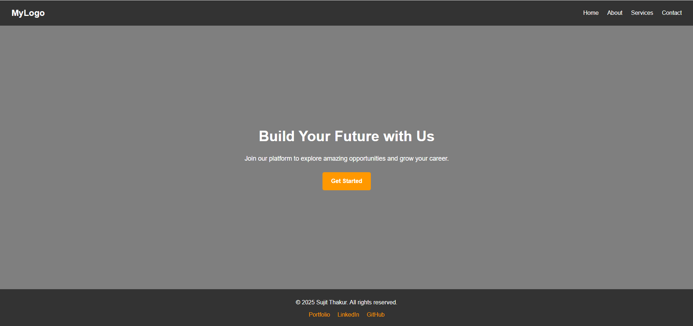

# Responsive Landing Page

## 📌 Overview

This project is a simple **responsive landing page** built with **HTML5** and **CSS3**.
The page includes a header with navigation, a hero section with a call-to-action button, and a footer with social links.
It is designed to be **mobile-friendly** using Flexbox and media queries.

---

## 🚀 Features

* Responsive navigation bar
* Hero section with background image, heading, and CTA button
* Footer with social media links
* Mobile-friendly layout using media queries
* Clean and modern design

---

## 🛠️ Tech Stack

* **HTML5** – for structure
* **CSS3** – for styling
* **Flexbox & Media Queries** – for responsiveness

---

## 📸 Screenshot  



---

## 📂 Project Structure

```
.
├── index.html
├── style.css
└── README.md
```

---

## 💻 How to Run

1. Clone the repository:

   ```bash
   git clone https://github.com/tsujit74/elevatlab
   ```
2. Open `index.html` in your browser.
3. (Optional) Use **VS Code Live Server** extension for auto-refresh.

---

## 📖 Concepts Learned

* Semantic HTML5 structure
* Flexbox for layout
* Media queries for responsiveness
* Styling header, hero, and footer blocks

---

## 📤 Submission

* GitHub Repo Link: https://github.com/tsujit74/elevatlab.git

---
## Author 
 # Sujit Thakur
